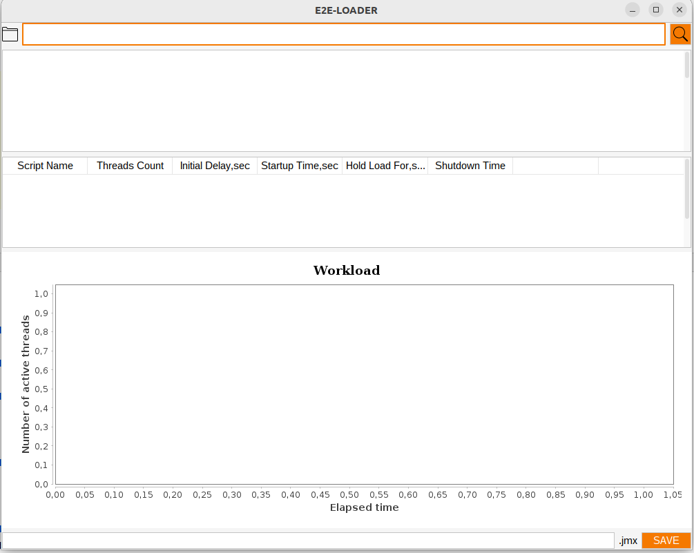
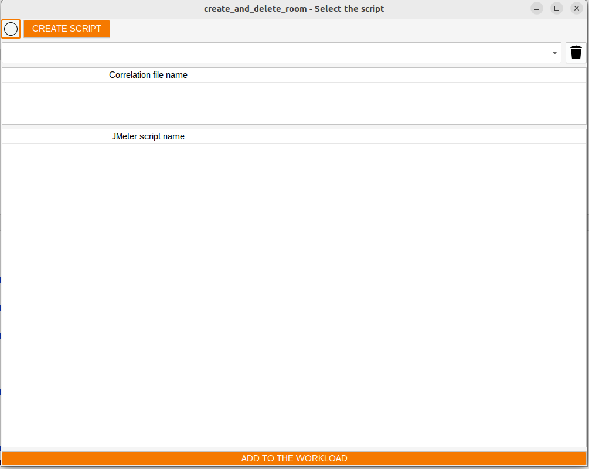
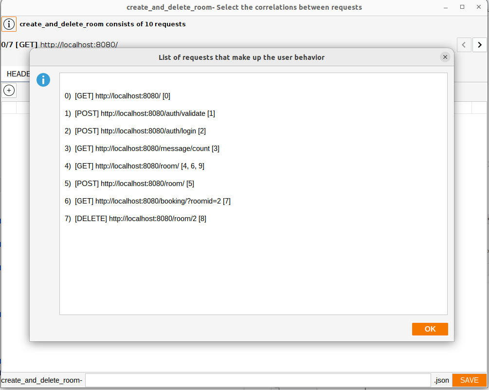
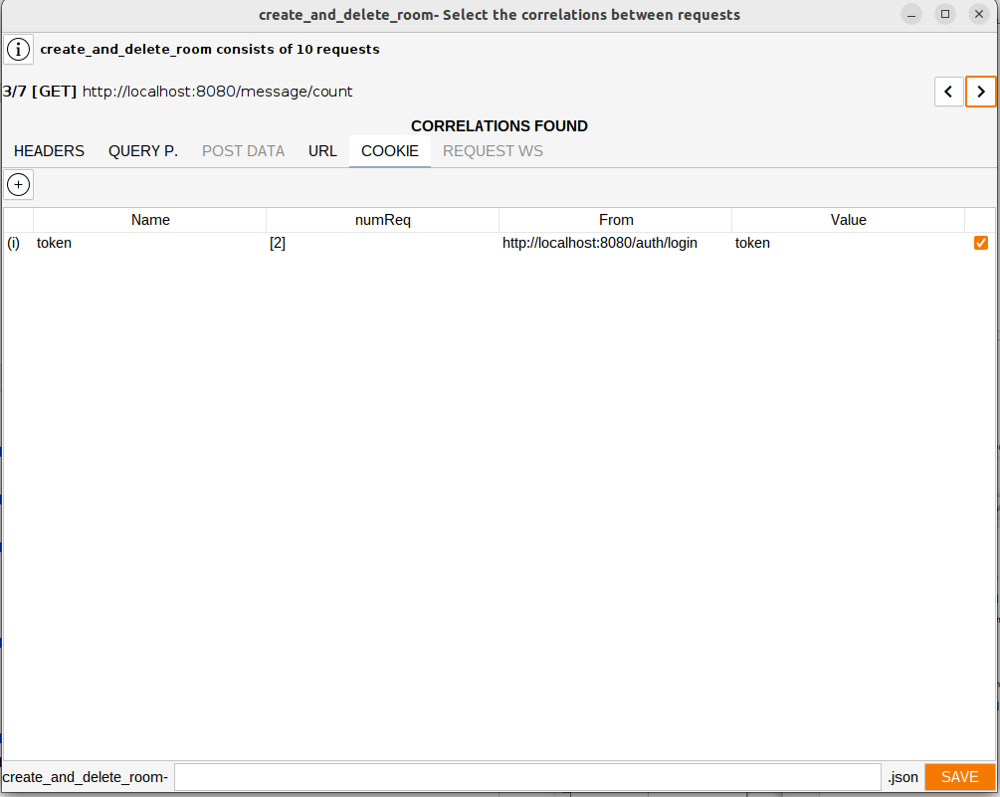
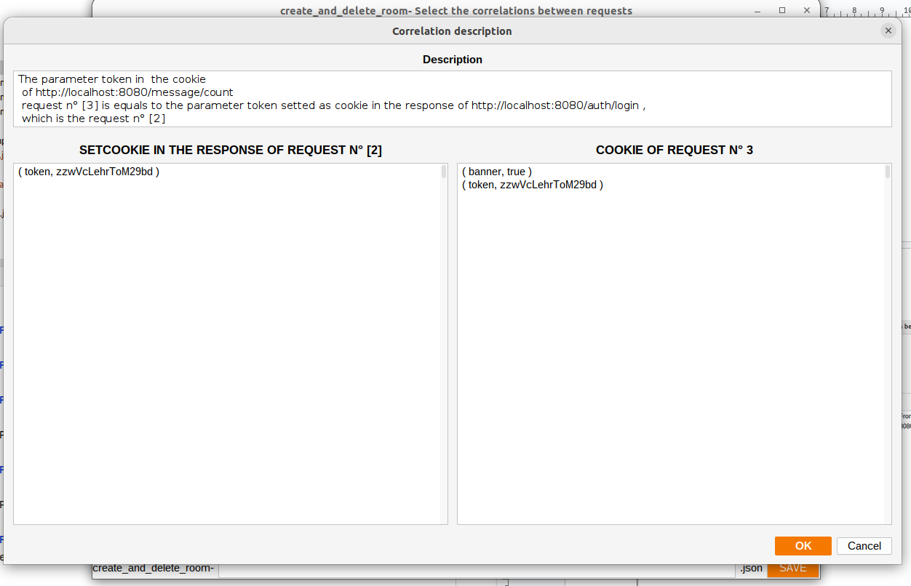
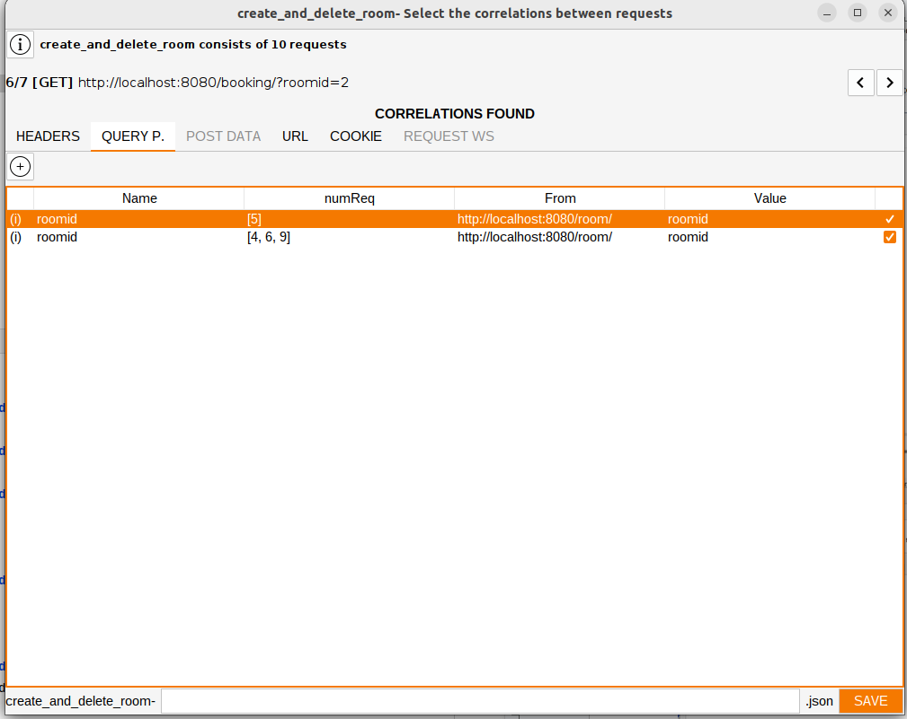
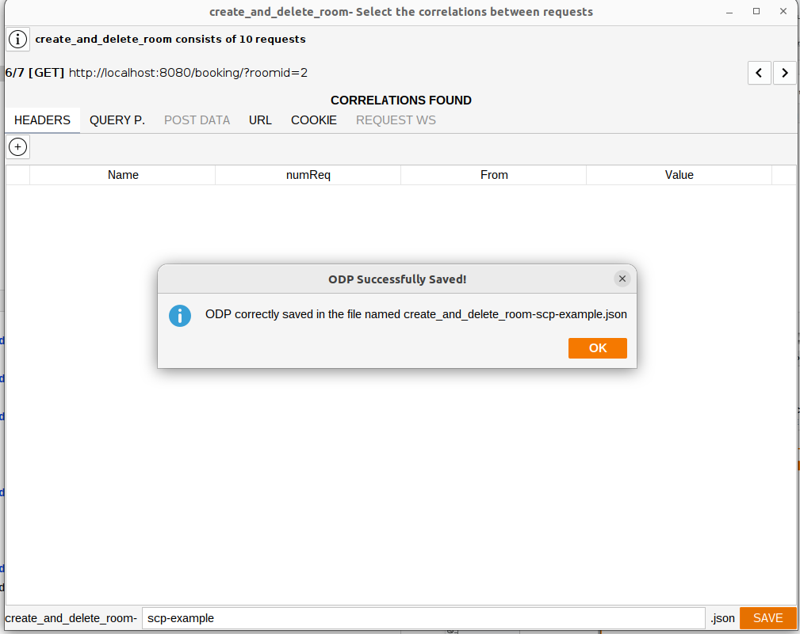
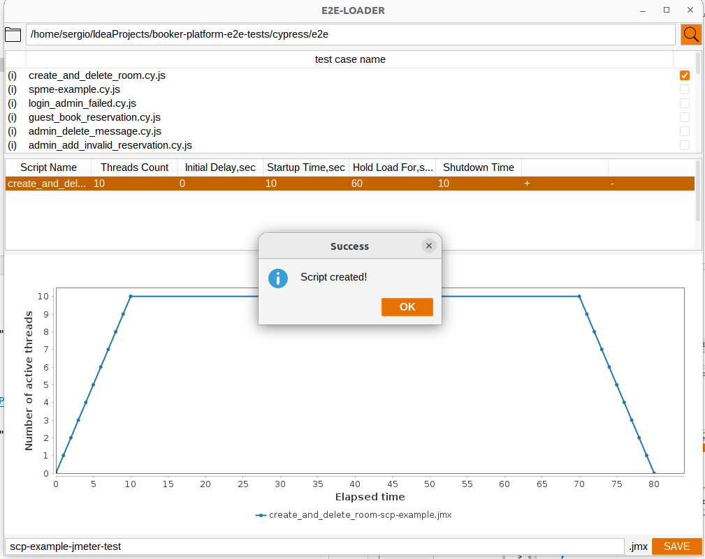
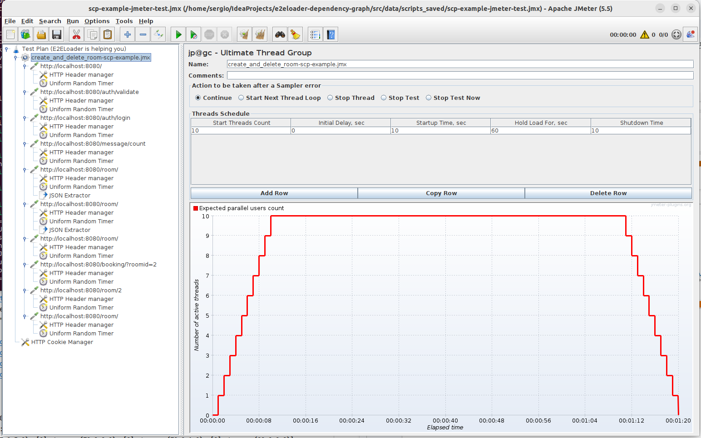

# 🚀 E2E Loader

E2E-Loader is an award-winning tool designed to streamline the generation of performance test workloads, leveraging existing GUI-level End-to-End (E2E) tests. 

This README includes: 
* 📘 **User Guide**. 
  Learn how to install, run, and optionally build E2E-Loader. Includes a minimal working example to get you started quickly.

* 🧑‍💻**Developer Guide**. 
  Explore the internal architecture and discover how to extend or customize E2E Loader. Intended for researchers and practitioners looking to adapt the tool to their needs.


# User Guide
E2E-Loader is a desktop application implemented using Java, designed to support the automated generation of performance testing workloads for web applications by reusing existing End-to-End (E2E) GUI-level test cases.

## Requirements

#### ✅ To execute E2E-Loader and Complete the Quickstart Example
- **Java**: 18.0.2.1 (Oracle)
- **Docker**: 27.3.1
- **OS**: Recommended Ubuntu 22.04.5 LTS

#### 🛠️ Additional Requirements to Build E2E-Loader
- **[Apache Maven](https://maven.apache.org/)**: 3.6.3

#### 🧪 Required to execute E2E tests, generate HAR files from scratch, and execute the generated workloads. 
- **Node.js**: 20.9.0 (required for running the E2E test and generating the HAR file from scratch)
- **npm**: 10.1.0 (required for running the E2E test and generating the HAR file from scratch)
- **[Apache JMeter](https://jmeter.apache.org/)**: 5.5 (required to inspect execute the workloads generated by E2E-Loader)
    - After downloading JMeter, you'll need to install the [JMeter Plugins Manager](https://jmeter-plugins.org/wiki/PluginsManager/)
    - After installing the Plugin Manager, you'll need to use it to install the [`Custom Thread Groups`](https://jmeter-plugins.org/wiki/ConcurrencyThreadGroup/) plugin.


## ⚡Quickstart

Getting started with **E2E-Loader** is simple and fast. Follow these steps to run or build the application:

### Step 1: Build the Schema Generator (REST API)
The Schema Generator component is used to generate a JSON Schema from structured objects received in responses. This component is implemented with Node.js and exposes a local REST API to which the E2E-Loader desktop app connects.

To build the Docker image, navigate to `schema_generator` folder inside the E2E-Loader repository:

```bash
cd schema_generator
```

Build the Docker image:
```bash
docker build -t schema-generator-app .
```
💡 Note that you do not need to start a container with the `schema-generator-app`. The E2E-Loader desktop app will take care of starting (and stopping) it for you.

### Step 2: (Optionally build and) Run the E2E-Loader Desktop App
The easiest way to get started is to run the provided JAR file:
```bash
java -jar target/e2eloader-scp-1.0-SNAPSHOT.jar
```

If you want to build E2E-Loader from scratch, you can do so by running the following Maven command, which will generate a new JAR file in the `target` directory:
```bash
mvn clean package
```


### Step 3: Usage Example

To quickly explore E2E Loader's features, we provide a ready-to-use test and its corresponding HAR file in the `/example` folder. No need to generate HAR files from scratch!

- **Test** :```\example\gui-tests\create_and_delete_room.cy```
- **HAR file**: ```\example\gui-test\hars\create_and_delete_room.har```

This test refers to the open-source system [restful-booker-platform](https://github.com/mwinteringham/restful-booker-platform), a Bed and Breakfast booking platform. The test automates creating a room and then deleting it.

#### 🧪 Generating Performance Tests E2E-Loader: Step-by-step tutorial
Once E2E-Loader is launched, the following interface will appear:
1. **Select input paths**: Provide the path to the directory containing your E2E tests, along with the `hars/` folder containing the corresponding HAR files. 
In your case: ```<your-path>\example\gui-tests\```


2. **Inspect available GUI tests**: After clicking the magnifying glass icon, a list of automatically detected GUI tests will appear. Each represents a possible user-behavior to add to your workload. For example, select the test `create_and_delete_room` as shown in the following screen capture.


3. **Load configurations**: A new window opens showing any saved configurations for the selected user-behavior. If none exist, create a new one by clicking the + button in the top-left corner.


4. **Inspect user-behavior details**: The new page allows you to: (a) Explore information about the user-behavior; (b) Inspect dependencies between requests; (c) Add new dependencies if needed.


5. **Review requests**: By clicking the (i) button in the top-left, you can see the list of requests composing the user-behavior. In this example, there will be 10 requests, to 7 distinct endpoints.


6. **Navigate dependencies**: Use the arrows to navigate through requests and view identified dependencies. For instance:
    - The request `/count` depends on a Cookie from the previous `/login` request.
    - Clicking the (i) icon next to a dependency row shows more details to decide whether to keep or discard it.



7. **Example dependency resolution**: Another case shows a query parameter dependency (`roomid=2`) identified with two possible requests (request 5 and request 6). The tester must decide which dependency to keep.

8. **Save configuration**: Once satisfied with dependencies, provide a name in the bottom field and click **Save**.

9. **Generate workload script**: Return to the previous page where the saved configuration now appears. Select it, then click **Create Script** (top-left) and finally **Add to Workload**.

10. **Build workload**: Back at the main screen of the tool, you can:
    - Populate the workload table.
    - Add multiple rows of the same user-behavior for realistic workload modeling.
    - Add additional user-behaviors (repeating from step 2).
    - Preview the shape of the workload through the interface.
11. **Export final workload**: Once satisfied, enter a name and click Save. 

This generates the final JMeter script, which is ready to use and can be opened also within JMeter, as shown in the following screen capture.



#### 👽 Advanced Example
For a more complex demonstration (e.g.: generating your own HAR files, executing the workload generated by E2E-Loader), you can build locally the same web application we mentioned before: [restful-booker-platform](https://github.com/mwinteringham/restful-booker-platform). All the instructions to set it up can be found in the linked repository.

In addition, we provide a full set of End-to-End GUI-level tests for the restful-booker-platform in [booker-platform-e2e-tests](https://github.com/SergioDME/booker-platform-e2e-tests). These tests are written in Cypress. Inside the `cypress/e2e` directory of that repository, you will find 22 different GUI tests, and a subfolder named `hars` containing the corresponding HAR files generated during execution.

If you want to write your own test and generate the HAR files, you can use the [`cypress-har-generator`](https://github.com/NeuraLegion/cypress-har-generator) plugin to automatically generate HAR files upon execution of a test. The code snippet that you may add to the test to achieve this would look like this:
```javascript
before(() => {
// start recording
cy.recordHar({
  includeHosts: ['.*localhost:8080'],
  excludePaths: [
    'socket$', '.woff$', '.woff2$', '.bmp$', '.css$', '.js$', '.gif$',
    '.ico$', '.pe?g$', '.png$', '.swf$', '.html$', '.svg$'
  ]
  });
});
after(() => {
  cy.saveHar({ fileName: 'create_and_delete_room.har', outDir: 'cypress/e2e/hars' });
});
```
This produces, every time the test is executed, a HAR file `create_and_delete_room.har` stored in `cypress/e2e/hars/`. So, to generate a HAR file from scratch, it suffices to re-execute the test.


---

# Developer Guide

In this section, we provide a brief overview of the E2E-Loader architecture, and then describe two meaningful ways to extend and customize E2E-Loader, providing specific pointers to interested researchers and practitioners.

## Overall Architecture
The E2E-Loader desktop app is implemented in Java, uses Maven as a build tool, and follows a three-layer architecture:
* **Entity Layer**: Defines core data structures such as requests, dependencies, and workload elements.
* **View Layer**: Implements the desktop GUI, handling user interactions for test selection, dependency inspection, and workload generation.
* **Service Layer**: Provides the business logic, including HAR parsing, dependency detection, configuration management, and script generation.

Additionally, the desktop app depends on the external `Schema Generator` component. This component (available in the `/schema_generator` directory of the E2E-Loader package) is implemented, using Node.js, as a REST API, to which the desktop app connects. 
The schema generator component is responsible for generating JSON Schema definitions from structured responses. The JSON Schema is used to refine the dependency matching process.

## Extending Dependency Matching
If you want to change how dependencies between requests are matched, focus on the class:
`AtomicDependenciesValidator` (located in `Services/Dependencies`)

Within this class you can refine or extend dependency evaluation logic. For example:

- `evaluate_header_atomic_dep` → header-based dependencies
- `evaluate_cookie_atomic_dep` → cookie-based dependencies

Adding new strategies may involve introducing new methods here or adapting existing ones.

## Adding New Export Formats
By default, E2E-Loader exports workload scripts in Apache JMeter format.
The class responsible for export is:
`JMeterAdaption` (in `Services/ScriptGeneration`)
This class converts HAR files and workload configurations into JMeter test plans.

The main call happens in:

`CorrelationFrameService.java` (line ~182) → `runJMeterAdaption`

To add another export format (e.g., **Gatling**, **Locust**, or **k6**):
1. Create a new class (e.g., `GatlingAdaption`) inside `Services/ScriptGeneration`.
2. Implement the conversion logic according to the target tool's format.
3. Replace or extend the call in `CorrelationFrameService.java` so that your new method is invoked alongside or instead of `runJMeterAdaption`.

---

# Related publications

- Di Meglio, Sergio, [Starace, Luigi Libero Lucio](https://luistar.github.io), and Di Martino, Sergio. "*E2E-Loader: A Tool to Generate Performance Tests from End-to-End GUI-Level Tests*". 2025 IEEE Conference on Software Testing, Verification and Validation (ICST). IEEE, 2025. https://doi.org/10.1109/ICST62969.2025.10989035

- Battista, Ermanno, Di Martino, Sergio, Di Meglio, Sergio, Scippacercola, Fabio, & [Starace, Luigi Libero Lucio](https://luistar.github.io) (2023, April). E2E-Loader: A framework to support performance testing of web applications. In 2023 IEEE Conference on Software Testing, Verification and Validation (ICST) (pp. 351-361). IEEE. https://doi.org/10.1109/ICST57152.2023.00040
